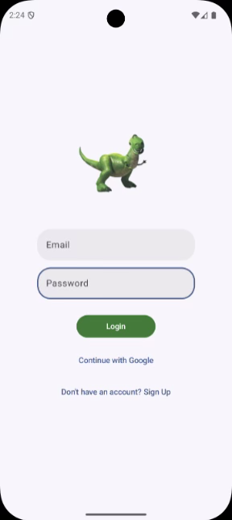
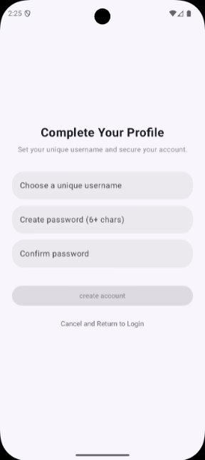
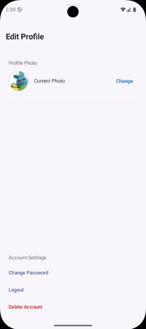
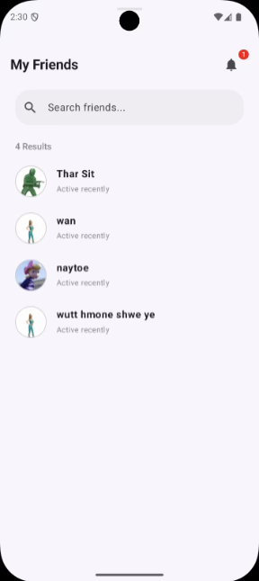
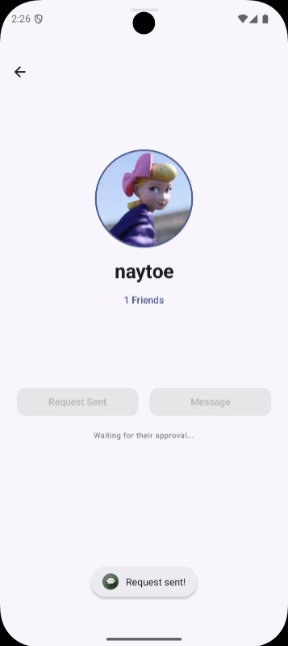
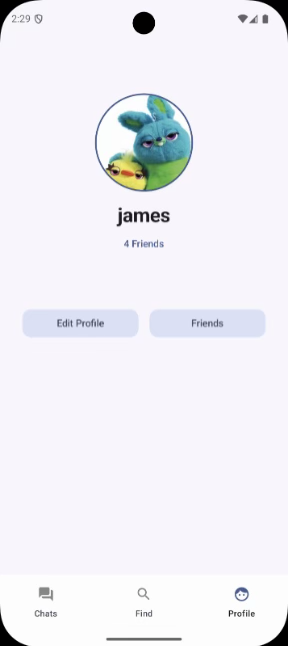
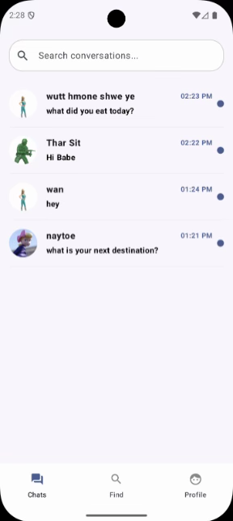
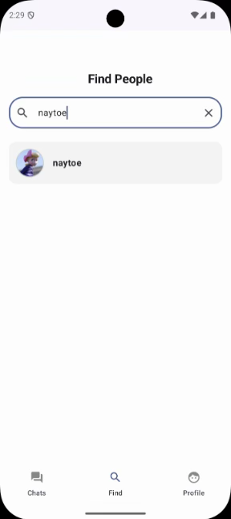

# ChatApp: A Real-Time Communication Android App

**Project Report** - Android Application Development (CSX4109)  
**Student:** Arkar Phyo (ID: 6520052)  
**Supervisor:** A. Suppachai Howimanporn  
**Submission Date:** 25 February 2026  
**Institution:** Assumption University, Faculty of Computer Science

---

## Abstract

Chatapp is an Android-based real-time communication platform designed to provide secure messaging and social networking capabilities. The application integrates Firebase for real-time data synchronization and Supabase for efficient media storage. This hybrid backend architecture ensures high performance, scalability, and seamless user interaction.

---

## 1. Introduction

In today's digital environment, real-time communication is essential. Chatapp aims to deliver a seamless messaging experience through a reactive UI design and cloud-integrated backend services.

### 1.1 Problem Statement

Many social applications experience latency issues and complicated onboarding processes.

### 1.2 Objectives

- Develop a secure authentication system
- Implement a real-time chat interface
- Create a dynamic user profile system with cloud-hosted media assets

---

## 2. Technologies Used

- **Reactive UI:** XML, Jetpack Compose & Material 3
- **Backend Services:** Firebase Authentication, Firestore NoSQL, Supabase Storage
- **Architecture:** MVVM with priority-based navigation patterns
- **Programming Language:** Kotlin (Coroutines & State Management)

---

## 3. System Architecture & Technologies

### 3.1 Core Technologies

- **Language:** Kotlin 2.x
- **UI Toolkit:** Jetpack Compose (Declarative UI)
- **IDE:** Android Studio

### 3.2 Hybrid Backend Strategy

- **Firebase Authentication** – Secure login with Email/Password and Google Sign-In
- **Cloud Firestore** – Real-time NoSQL database for chat and user data
- **Supabase Storage** – Cloud storage for profile avatars and media assets

---

## 4. Key Features

### 4.1 Secure Authentication & Onboarding

- Multi-method login (Email & Google Sign-In)
- Pending setup state for username and avatar initialization
- Secure password change and account deletion with re-authentication





### 4.2 Social Networking & Discovery

- Bidirectional friend request system (Send, Accept, Reject)
- User profile views with friend counts and bios





### 4.3 Real-Time Messaging Engine

- Instant messaging using Firestore Snapshot Listeners
- Real-time read receipts
- Conversation deletion without affecting other participants




### 4.4 Dynamic Profile Customization

- Cloud-synced avatars from Supabase Storage
- Expandable avatar library without app updates
- Optimized image loading using Coil


---

## 5. Challenges & Resolutions

| Challenge | Resolution |
|-----------|-----------|
| Google Sign-In Developer Error | Registered SHA-1 fingerprint and updated google-services.json |
| Firestore indexing issues | Created composite indexes |
| UI refresh problems | Implemented Snapshot Listeners |
| Performance lag | Integrated Coil image loading |
| Navigation complexity | Improved with gesture-based interactions |

---

## 6. Getting Started

### Prerequisites

- Android Studio (latest stable version)
- Java Development Kit (JDK 11 or higher)
- Firebase project setup
- Supabase account for media storage

### Setup Instructions

1. **Clone the repository**
   ```bash
   git clone <repository-url>
   cd Chatapp
   ```

2. **Configure Firebase**
   - Add your `google-services.json` file in the `app/` directory
   - Ensure SHA-1 fingerprint is registered in Firebase Console

3. **Configure Supabase**
   - Set up Supabase Storage bucket for media assets
   - Update configuration in the application

4. **Build the project**
   ```bash
   ./gradlew build
   ```

5. **Run the app**
   - Open the project in Android Studio
   - Select a device or emulator
   - Click "Run" or press `Shift + F10`

---

## 7. Project Structure

```
Chatapp/
├── app/
│   ├── src/
│   │   ├── main/
│   │   │   ├── java/              # Kotlin source files
│   │   │   ├── res/               # Resources (layouts, drawables)
│   │   │   └── AndroidManifest.xml
│   │   ├── test/                  # Unit tests
│   │   └── androidTest/           # Instrumented tests
│   ├── build.gradle.kts           # App-level dependencies
│   └── google-services.json
├── functions/                      # Cloud Functions
├── gradle/
│   └── libs.versions.toml         # Dependency versions
├── build.gradle.kts               # Project-level build config
├── settings.gradle.kts
├── firebase.json
└── README.md
```

---

## 8. Building & Deployment

### Debug Build
```bash
./gradlew assembleDebug
```

### Release Build
```bash
./gradlew assembleRelease
```

---

## 9. Conclusion

The Chatapp project demonstrates the integration of modern Android development practices with cloud-native backend solutions. By leveraging Jetpack Compose and a hybrid backend strategy, the application achieves scalability, performance, and maintainability. This project provided comprehensive experience across the full mobile development lifecycle and strengthened practical software engineering skills.

---

## License

This project is part of the coursework for CSX4109: Android Application Development at Assumption University.

---

**Last Updated:** February 25, 2026
